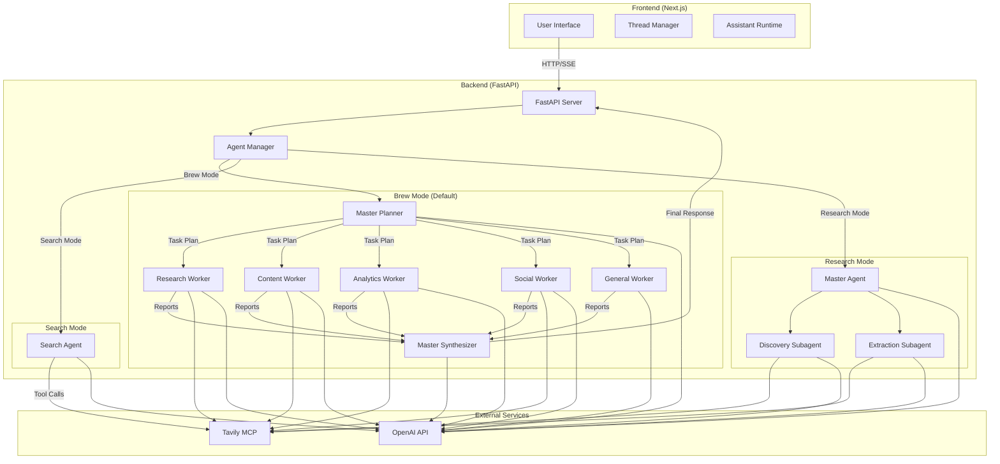
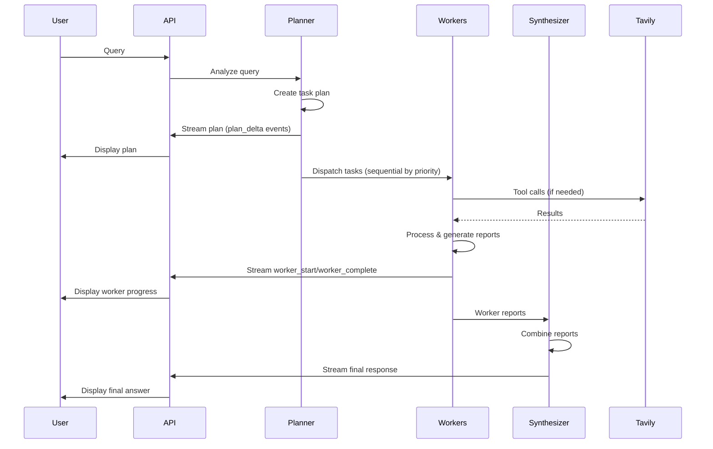

# Marketing Agents Team 🚀

A sophisticated multi-agent AI system designed for comprehensive marketing research, content creation, analytics, and strategy. Built with LangGraph, FastAPI, and Next.js, featuring three distinct operational modes optimized for different use cases.

## ✨ Key Features

- **Multi-Mode Architecture**: Three specialized modes - **Brew** (default), **Search**, and **Research** - each optimized for different complexity levels
- **Brew Mode - Multi-Agent Orchestration**: Master orchestrator with specialized workers (Research, Content, Analytics, Social, General) working sequentially based on task priority
- **Advanced Model Support**: Optimized for GPT-4.1, GPT-5 series (with reasoning/thinking modes), and OpenAI o1/o3 series
- **Thinking/Reasoning Toggle**: Dynamic control over model reasoning effort (high/low) for rapid answers or deep analysis
- **Real-time Streaming**: Rich UI experience with streaming thoughts, status updates, tool calls, worker progress, and task plans
- **Tavily MCP Integration**: Leverages Tavily's Model Context Protocol (MCP) for high-tier web searching and full-text extraction
- **Thread-based Conversations**: Persistent conversation history with thread management
- **Modern UI/UX**: Built with Next.js 15+, Tailwind CSS 4, Radix UI, and `@assistant-ui/react`

---

## 🏗️ Architecture

### System Overview

The system consists of three operational modes, each with distinct architectures:

#### **Brew Mode** (Default) - Multi-Agent Orchestration

- **Planner**: Tool-less master orchestrator that analyzes queries and creates structured task plans
- **Workers**: Specialized deep agent workers that execute tasks sequentially based on priority:
  - **Research Worker**: Web research, fact-finding, summaries (has Tavily tools)
  - **Content Worker**: Writing, copy, posts, messaging (has Tavily tools)
  - **Analytics Worker**: Metrics, KPIs, analysis, experiments (has Tavily tools)
  - **Social Worker**: Platform strategy, content ideas, hooks (has Tavily tools)
  - **General Worker**: General questions without web access
- **Synthesizer**: Tool-less master that combines worker reports into a unified final response

#### **Search Mode** - Fast Single-Agent

- Simple ReAct loop with a single agent
- Optimized for quick answers to everyday questions
- Direct tool execution without multi-agent coordination

#### **Research Mode** - Deep Research

- Master agent with specialized subagents
- Discovery agent for finding relevant sources
- Extraction agent for deep content extraction
- Multi-phase research protocol

### Backend (Python/FastAPI)

- **Framework**: FastAPI for high-performance streaming
- **Agent Logic**: LangGraph for complex agentic workflows
- **Agent Modes**: Brew (default), Search, Research
- **Research Tools**: Tavily Search & Extract via MCP
- **Persistence**: Memory checkpointer for thread history and state management
- **Streaming**: Server-Sent Events (SSE) for real-time updates

### Frontend (Next.js)

- **Framework**: Next.js 15+ (App Router)
- **Styling**: Tailwind CSS 4 & Lucide React icons
- **Components**: Radix UI & Shadcn UI
- **AI Interface**: `@assistant-ui/react` for polished chat experience
- **State Management**: LocalStorage for thread persistence

---

## 📊 Architecture Diagram



### Brew Mode Flow (Default)



---

## 🚀 Getting Started

### Prerequisites

- [Python 3.12+](https://www.python.org/downloads/)
- [Node.js 18+](https://nodejs.org/)
- [`uv`](https://github.com/astral-sh/uv) (Highly recommended for Python dependency management)

### 1. Clone the Repository

```bash
git clone <repository-url>
cd marketing-agents-team
```

### 2. Environment Configuration

Create a `.env` file in the `backend/` directory:

```env
OPENAI_API_KEY=sk-...
TAVILY_API_KEY=tvly-...
PORT=8000
```

### 3. Backend Setup

```bash
cd backend

# Using uv (recommended)
uv sync

# Run the server
uv run python main.py
# Or directly:
uv run uvicorn app.server:app --reload --port 8000
```

The backend will be available at `http://localhost:8000`.

### 4. Frontend Setup

```bash
cd frontend
npm install
npm run dev
```

The frontend will be available at `http://localhost:3000`.

---

## 🛠️ Usage

### Mode Selection

The system supports three modes (Brew is the default):

1. **Brew Mode** (default): Multi-agent orchestration for complex marketing tasks

   - Best for: Content strategy, research, analytics, social media planning
   - Features: Sequential worker execution by priority, task planning, synthesis

2. **Search Mode**: Fast single-agent search

   - Best for: Quick answers, simple queries
   - Features: Direct ReAct loop, minimal overhead

3. **Research Mode**: Deep research with subagents
   - Best for: Comprehensive research reports
   - Features: Discovery + extraction phases, detailed synthesis

### Typical Workflow (Brew Mode)

1. **Enter a Query**: Ask a complex marketing question (e.g., "Create a social media strategy for Q1 2025")
2. **Watch the Plan**: The planner generates a task plan visible in the UI (plan_delta events)
3. **Monitor Workers**: Track worker progress as they execute tasks sequentially by priority (worker_start/worker_complete events)
4. **Final Synthesis**: Receive a unified, professional response combining all worker outputs

### Model Selection

- **Thinking Models**: GPT-5 series, o1/o3 - Enable "Thinking" toggle for high reasoning effort
- **Classic Models**: GPT-4.1 series - Standard chat models

### Streaming Events

The system streams various event types:

- `plan_delta`: Task plan updates
- `worker_start`: Worker begins task
- `worker_complete`: Worker finishes task
- `status`: Status updates
- `content`: Token streaming (final response)
- `thought`: Reasoning/thinking content (for reasoning models)
- `tool_start`: Tool execution begins
- `tool_result`: Tool execution results

---

## 📂 Project Structure

```
marketing-agents-team/
├── backend/
│   ├── app/
│   │   ├── agent.py              # Agent Manager (mode orchestration)
│   │   ├── server.py              # FastAPI streaming endpoints
│   │   ├── brew/                  # Brew mode implementation
│   │   │   ├── graph.py           # Brew graph (planner → workers → synthesizer)
│   │   │   ├── state.py           # State definitions (BrewState, TaskPlan, etc.)
│   │   │   ├── prompts.py         # System prompts for planner/synthesizer/workers
│   │   │   └── workers.py         # Worker agent creation
│   │   ├── search/                # Search mode implementation
│   │   │   ├── graph.py           # Simple ReAct loop
│   │   │   └── prompts.py         # Search agent prompts
│   │   └── research/              # Research mode implementation
│   │       ├── graph.py           # Deep research graph
│   │       ├── prompts.py         # Research prompts
│   │       └── subagents.py       # Subagent configurations
│   ├── main.py                    # Server entry point
│   └── pyproject.toml             # Backend dependencies
├── frontend/
│   ├── src/
│   │   ├── app/                   # Next.js pages & layouts
│   │   ├── components/            # UI & Chat components
│   │   │   ├── thread.tsx         # Main chat thread
│   │   │   ├── thread-list.tsx    # Thread sidebar
│   │   │   ├── mode-selector.tsx  # Mode selection (if implemented)
│   │   │   └── ui/                # Shadcn UI components
│   │   └── providers/             # Theme & State providers
│   ├── package.json               # Frontend dependencies
│   └── tailwind.config.ts         # Styling configuration
└── README.md
```

---

## 🔧 Technical Details

### Agent Manager

The `AgentManager` class initializes and manages all three modes:

- Loads Tavily MCP tools
- Configures the base model with dynamic overrides
- Initializes Brew, Search, and Research graphs
- Provides mode selection via `get_agent(mode)`

### Brew Mode State Management

- **BrewState**: Main state containing messages, task_plan, worker_reports, final_response
- **TaskPlan**: Structured plan with reasoning and list of TaskAssignments
- **TaskAssignment**: Worker name, task description, priority
- **WorkerReport**: Worker output with status, result, sources
- **WorkerState**: State for individual worker execution

### Streaming Architecture

- Uses LangGraph's `astream_events` for fine-grained event streaming
- Filters events based on mode (brew mode only streams from synthesizer)
- Emits structured JSON events over SSE
- Handles reasoning/thinking content for GPT-5/o1/o3 models

### Model Configuration

- Base model: `gpt-4.1` with configurable fields
- Dynamic model selection via `model_name` config
- Reasoning configuration for GPT-5 series (`reasoning`, `output_version`, `reasoning_effort`)
- Reasoning effort for o1/o3 series (`reasoning_effort`)

---

## 🎯 Use Cases

### Brew Mode

- Marketing strategy development
- Content creation workflows
- Social media campaign planning
- Analytics and KPI analysis
- Multi-faceted research tasks

### Search Mode

- Quick fact-checking
- Simple web searches
- Fast answers to straightforward questions

### Research Mode

- Comprehensive research reports
- Deep-dive analysis
- Academic-style research
- Multi-source synthesis

---

## 📝 Notes

- Brew mode is the default when no mode is specified
- Workers execute sequentially based on task priority (deterministic execution order)
- The synthesizer only streams tokens (not worker outputs)
- Thread persistence uses in-memory checkpointer (can be upgraded to SQLite/PostgreSQL)
- Tavily MCP requires `npx mcp-remote` bridge for connection

---

## 🔮 Future Enhancements

- SQLite/PostgreSQL checkpointer for persistent thread history
- Additional worker types
- Custom mode creation
- Enhanced error handling and retry logic
- Performance optimizations for large-scale deployments
