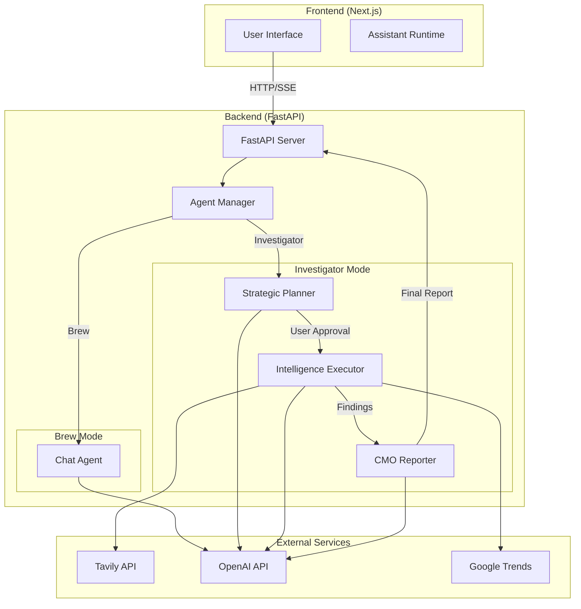
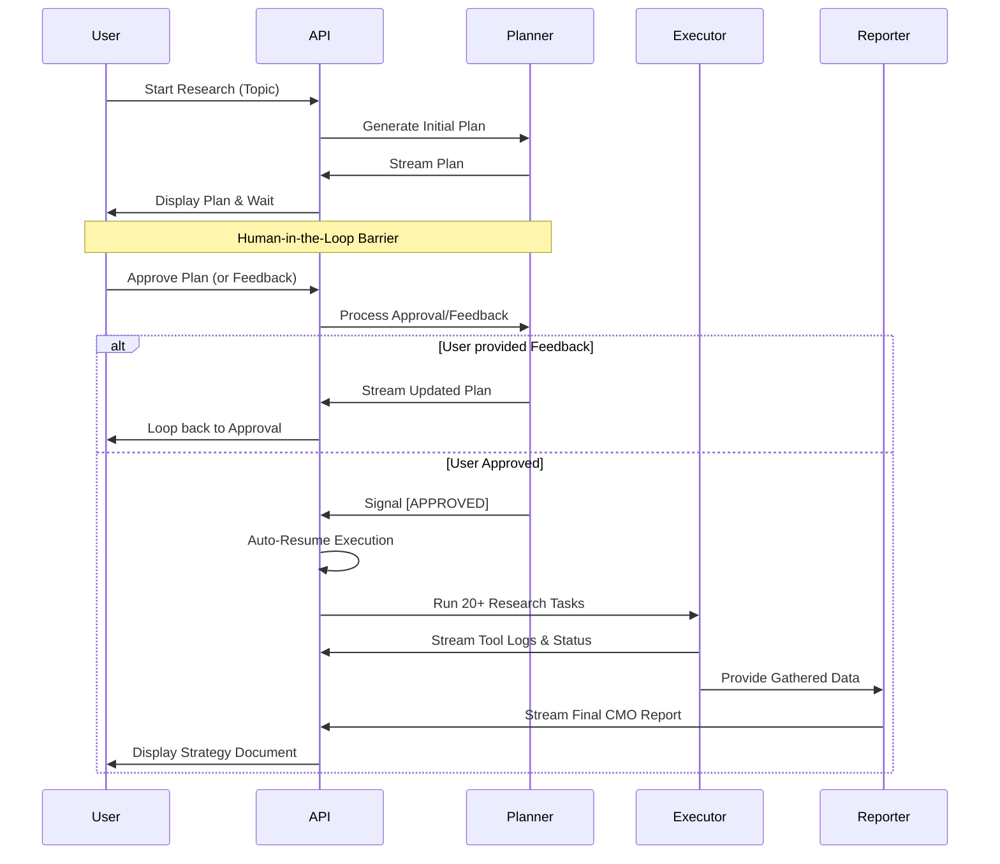

# Marketing Agents Team 🚀

A sophisticated multi-agent AI system designed for comprehensive marketing research, content creation, analytics, and strategy. Built with LangGraph, FastAPI, and Next.js, featuring three distinct operational modes optimized for different use cases.

## ✨ Key Features

- **Multi-Mode Architecture**: Distinct operational modes - **Brew** (Standard Chat) and **Investigator** (Deep Research)
- **Investigator Mode - Human-in-the-Loop**: A research protocol that generates a strategic plan, waits for user approval/feedback, and then executes automatically
- **Automated Execution Flow**: Once the plan is approved, the system seamlessly transitions from planning to multi-step research execution and final reporting
- **Advanced Model Support**: Optimized for GPT-4.1, GPT-5 series (with reasoning/thinking modes), and OpenAI o1/o3 series
- **Real-time Streaming**: Rich UI experience with streaming thoughts, status updates, tool calls, task plans, and final reports
- **Professional Toolset**: Specialized tools for competitor scraping, Google Trends analysis, and SEO keyword research
- **Modern UI/UX**: Built with Next.js 15+, Tailwind CSS 4, Radix UI, and `@assistant-ui/react`

---

## 🏗️ Architecture

### System Overview

The system consists of two primary operational modes:

#### **Brew Mode** (Default) - Standard Chat
- Simple ReAct-style agent for general-purpose chat and marketing questions
- Maintains conversation history and thread context
- Optimized for quick, direct interaction

#### **Investigator Mode** - Strategic Lead Gen & Research
- **Planner**: Strategic lead that analyzes the topic and builds a 20-25 task research plan
- **Human-in-the-Loop**: Interrupts execution to allow user review and modification of the research plan
- **Executor**: Non-conversational "Intelligence Officer" that executes the approved plan using specialized tools
- **Reporter**: CMO-level synthesizer that compiles all findings into a professional growth strategy report

### Backend (Python/FastAPI)

- **Framework**: FastAPI for high-performance streaming
- **Agent Logic**: LangGraph for stateful multi-phase workflows
- **Persistence**: SQLite checkpointer for robust thread management and state recovery
- **Streaming**: Server-Sent Events (SSE) for real-time updates across all phases

### Frontend (Next.js)

- **Framework**: Next.js 15+ (App Router)
- **Styling**: Tailwind CSS 4
- **AI Interface**: `@assistant-ui/react` for polished chat experience

---

## 📊 Architecture Diagram



### Investigator Mode Flow



---

## 🚀 Getting Started

### Prerequisites

- [Python 3.12+](https://www.python.org/downloads/)
- [Node.js 18+](https://nodejs.org/)
- [`uv`](https://github.com/astral-sh/uv) (Highly recommended for Python dependency management)

### 1. Clone the Repository

```bash
git clone <repository-url>
cd marketing-agents-team
```

### 2. Environment Configuration

Create a `.env` file in the `backend/` directory:

```env
OPENAI_API_KEY=sk-...
TAVILY_API_KEY=tvly-...
PORT=8000
```

### 3. Backend Setup

```bash
cd backend

# Using uv (recommended)
uv sync

# Run the server
uv run python main.py
# Or directly:
uv run uvicorn app.server:app --reload --port 8000
```

The backend will be available at `http://localhost:8000`.

### 4. Frontend Setup

```bash
cd frontend
npm install
npm run dev
```

The frontend will be available at `http://localhost:3000`.

---

### 5. Terminal Verification (Investigator Mode)

You can test the Investigator mode directly from your terminal:

```bash
# Ensure backend is running first
python run_backend_terminal.py
```

---

## 🛠️ Usage

### Mode Selection

The system supports two primary modes:

1. **Brew Mode** (default): Standard Chat Assistant
   - **Best for**: Marketing advice, copywriting, brainstorming, and general questions.
   - **Interface**: Direct chat with streaming responses.

2. **Investigator Mode**: Deep strategic research
   - **Best for**: Competitor espionage, lead generation, market validation, and CMO-level strategy reports.
   - **Interface**: 3-phase protocol (Plan -> Execute -> Report) with Human-in-the-Loop approval.

### Typical Workflow (Investigator Mode)

1. **Enter a Topic**: Provide a research theme (e.g., "Real Estate Tokenization").
2. **Review the Plan**: The system generates a structured multi-task research plan.
3. **Approve or Modify**: 
   - Press **Enter** to approve and start automated execution.
   - Type feedback to modify the plan (e.g., "Add competitor Polymesh").
4. **Automated Search**: The executor runs web searches, scrapes landing pages, and analyzes trends.
5. **Final Strategy**: Receive a comprehensive professional report.

### Model Selection

- **Thinking Models**: o1/o3 - Optimized for complex planning and reasoning.
- **Classic Models**: GPT-4.1-mini - Fast and effective for execution and reporting.

---

## 📂 Project Structure

```
marketing-agents-team/
├── backend/
│   ├── app/
│   │   ├── server.py              # FastAPI endpoints & auto-resume logic
│   │   ├── agent.py               # Mode manager (Brew/Investigator)
│   │   ├── investigator/          # Investigator Mode
│   │   │   ├── graph.py           # Planner -> Executor -> Reporter graph
│   │   │   ├── schema.py          # Structured output schemas (Tasks, Intent)
│   │   │   ├── state.py           # LangGraph state definition
│   │   │   └── prompts.py         # Strategic system prompts
│   │   ├── brew/                  # Brew Mode implementation
│   │   └── tools/                 # Research toolset (scrape, trends, search)
│   ├── main.py                    # Entry point
│   └── requirements.txt           # Dependencies
├── frontend/                      # Next.js 15 application
├── run_backend_terminal.py        # Interactive terminal test script
└── README.md
```

---

## 🔧 Technical Details

### Investigator State Management

- **AgentState**: Orchestrates the flow between planning, data gathering, and reporting.
- **Intent Discovery**: Uses structured LLM output to classify user feedback as `approve` or `update`.
- **Checkpointing**: Full state persistence via SQLite, allowing research to be resumed at any point.

### Automated Streaming Architecture

- Uses LangGraph's `astream_events` (v1) for real-time visibility.
- **Auto-Resume**: The server detects manual plan approval and automatically triggers the Executor phase without further user intervention.
- **Non-Conversational Executor**: Prompted to act as a "B2B Intelligence Officer" that focuses strictly on reporting facts rather than conversational fluff.

---

## 🎯 Use Cases

- **Lead Generation**: Finding funded startups, law firms, and consultants in specific niches.
- **Competitor Analysis**: Scraping rival landing pages to extract value propositions and tech stacks.
- **Market Validation**: Using Google Trends and Autocomplete to gauge buyer intent.
- **Strategic Reporting**: Standardizing chaotic research data into structured business reports.

---

## 📝 Notes

- **Unified Flow**: The same `thread_id` is used across all phases to maintain context.
- **Tavily Integration**: High-tier web indices are used for deep scraping and fresh market data.
- **Privacy**: No user data is stored beyond the local SQLite checkpoint database.
